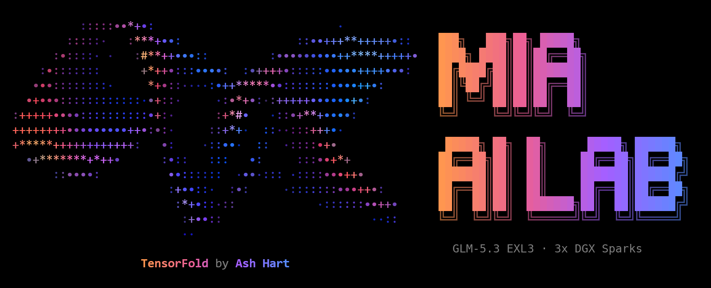

<h1 align="center">GLM-5.3 EXL3 on DGX Sparks with TensorFold</h1>

<p align="center">
  <sub>by <a href="https://x.com/MiaAI_lab">Mia's AI Lab</a></sub>
  <br><br>
  <a href="https://github.com/sponsors/MiaAI-Lab" target="_blank" rel="noopener noreferrer" style="display:inline-block;margin:0 8px;vertical-align:middle;"></a>
  <a href="https://x.com/MiaAI_lab" target="_blank" rel="noopener noreferrer" style="display:inline-block;margin:0 8px;vertical-align:middle;"></a>
</p>

<p align="center">
  
</p>

Serve **[GLM-5.3](https://huggingface.co/zai-org/GLM-5.3)**, Z.ai's full model (78 layers of MLA with DeepSeek sparse
attention, 256 routed experts, an MTP head), from three NVIDIA DGX Sparks (GB10, 128 GB each, joined by a triangle of
ConnectX-7 cables) through an OpenAI-compatible API. It runs [TensorFold](https://github.com/ashhart/TensorFold) v0.6.0
on all three Sparks (one rank on each) in NVIDIA's PyTorch container, plus 109 patches (the
[GLM-5.3-Flash recipe](https://github.com/MiaAI-Lab/GLM-5.3-Flash-EXL3-2x-DGX-Sparks-TensorFold)'s 68 of v1.4, and 41
for full GLM-5.3): the 3-rank layout and loader for mixed-width EXL3 experts, our own prompt kernels, DSpark and copy
drafts, RoCE all-gathers, an FP8 or 4-bit KV cache, context parallelism for a ~500k-token window, 2 to 4 requests at
once, and a prompt cache on NVMe.

- Checkpoint: [`Mia-AiLab/GLM-5.3-EXL3-2.75bpw-TensorFold`](https://huggingface.co/Mia-AiLab/GLM-5.3-EXL3-2.75bpw-TensorFold),
  Mia's AI Lab's own EXL3 quantization (routed experts at 2.75 bits a weight on average, each expert at its own width
  from 2 to 4 bits, BF16 elsewhere, ~273 GiB, ~86 GiB on each Spark), calibrated for how TensorFold serves it
  ([model card](https://huggingface.co/Mia-AiLab/GLM-5.3-EXL3-2.75bpw-TensorFold))
- Drafter: Red Hat AI's DSpark speculator,
  [`RedHatAI/GLM-5.3-speculator.dspark`](https://huggingface.co/RedHatAI/GLM-5.3-speculator.dspark), or the
  checkpoint's own MTP head (`DRAFTER`, see [Configuration](#configuration))
- API model id: `GLM-5.3-EXL3`
- Context: **163,840 tokens** by default (FP8 KV cache); **499,712 tokens** in the long-context mode (`KV=fp4 CP=1`,
  one request at a time); 2 to 4 requests decoded together with `PARALLEL`
- Exact: a drafted reply equals the serial one, and requests sent together get the replies they get alone
  (`tools/exact.py`)
- Tool calling, `/tokenize` and `/metrics` (the GLM-5.3-Flash recipe's server)
- One command on the first Spark: `./start.sh` sets up all three Sparks and starts the three ranks; `./stop.sh` stops them

Built on [TensorFold](https://github.com/ashhart/TensorFold) by Ash Hart ([ashhart](https://github.com/ashhart)) and
the TensorFold contributors. Patch 0106 carries [drowzeys](https://github.com/drowzeys)' EXL3 prompt-expert kernels,
and the context parallelism of patches 0112-0113 follows drowzeys' scheme, both from
[drowzeys/TensorFold](https://github.com/drowzeys/TensorFold) (branch `glm-moe-dsa-tp4`, commit
[befd47d](https://github.com/drowzeys/TensorFold/commit/befd47d), Apache 2.0). Everyone else this builds on is in
[Credits](#credits) and [`CREDITS.md`](CREDITS.md).

## Performance

Three DGX Sparks, one request at a time, at the defaults unless a row says otherwise (FP8 KV cache, 4-bit dense
weights, DSpark plus copy drafts, RoCE all-gathers). Every figure names the boot it was measured on; a range is three
runs unless stated. Greedy decode and prefill were measured with [sparkDash](https://github.com/MiaAI-Lab/sparkDash)
through the OpenAI API; sampled decode with 512-token replies at temperature 1.0, top_p 0.95 (a chat client's
default), seeds 11, 22 and 33; long prompts with `tools/needle.py`.

**Default mode** (`./start.sh`: 163,840-token window, FP8 KV)

| | Prose | Code |
| --- | ---: | ---: |
| Decode, greedy | 30.6-32.6 tok/s | 41.7-43.2 tok/s |
| Decode, sampled | 26.5-27.8 tok/s | 31.2-33.1 tok/s |

| Prompt | 8k tokens | 16k tokens | 32k tokens |
| --- | ---: | ---: | ---: |
| Prefill | 630 tok/s | 679 tok/s | 660 tok/s |

Boot dflt, patches through 0129. Its start found less free memory than the full window needs, so `start.sh` started
again at 155,648 tokens (its fallback, see [Memory](#memory)). On another pair of boots (ovl1 / ovl0, 147,456-token
window), prefill at 16k / 32k was **684 / 670 tok/s** with 0127's overlapped MoE exchange (the default) and 662 / 649
with it off, two runs each.

**Long-context mode** (`KV=fp4 CP=1 CONTEXT=499712 PREFILL_ROWS=3072 TF_GLM_CP_GRAPHS=1`)

| | Measured | Boot |
| --- | --- | --- |
| Prefill | **448 tok/s** at 9.9k tokens, **434 tok/s** at 94k (needles correct) | cp500b: 499,712-token window, 3,072-row chunks |
| Decode, greedy | prose 31.7-32.5, code 41.8-42.3 tok/s | fp4g627x: the same mode at a 626,688-token window, 2,048-row chunks, patches through 0128 |
| Decode, sampled | prose 22.9-24.0, code 25.7-29.4 tok/s | fp4g627x |
| Long prompts | needles correct at 9.9k and 94k tokens (cp500b), and at 314k (fp4g655, 655,360-token window) | |
| Exact | 12/12 | cp500b |

Context parallelism (`CP=1`) keeps every third token's caches on each Spark, so the window is about three times the
default one; decode under it is as fast as without it (fp4g655 below). Sampled replies decode slower than greedy ones:
fewer drafts survive the target's sampled token (~2 tokens a round on prose against ~3-4 greedy).

Decode speed depends on the text: drafts land more often on predictable text. On worked arithmetic (thinking on) the
drafter's acceptance was 87% and a request averaged ~45 tok/s, with bursts above 70.

### Concurrent requests (0134, 0138-0139)

`PARALLEL=2` (to 4; not with `CP=1`) decodes that many requests together, each with its own `CONTEXT` window, with
CUDA graphs for the batched verify windows. Greedy, the same prompts, FP8 KV:

| Boot | Requests together | Total tok/s | Each | Exact |
| --- | --- | ---: | --- | --- |
| par2g (`PARALLEL=2 CONTEXT=65536`) | 1 / 2 | 27.3 / **37.8** | 27.3 / 18.9-20.0 | 12/12 |
| par4g (`PARALLEL=4 CONTEXT=32768`) | 1 / 4 | 27.1 / **48.2** | 27.1 / 12.1-14.0 | 12/12 |

A request's reply hash is the same alone and beside 1 or 3 others. One request alone is slower than on the
single-stream server (`PARALLEL=1`), so `PARALLEL` pays only when several requests really arrive together.
`TF_GLM_MULTI_GRAPHS=top` captures fewer graphs for less memory.

### Copy drafts checked by DSpark (0140)

Prompt-lookup ("copy") drafts used to replace DSpark's block whenever the reply matched earlier text. With 0140
(`COPY_HYBRID=1`, the default) a copy is checked against DSpark's own picks: where they agree it extends past the
block, where they part DSpark's chain takes over. Proposals only: every pair below has the same reply hash. Boots
cpyon (on) and cp500b (off), both `KV=fp4 CP=1 CONTEXT=499712`, [`tools/copy_ab.py`](tools/copy_ab.py), 1024-token
replies, thinking off, greedy and two sampled seeds:

| Prompt | Off tok/s | On tok/s | Change |
| --- | ---: | ---: | --- |
| Return a 140-line Python file with docstrings added | 63.5-63.9 | 56.4-63.9 | -3.7% (one greedy run -11%, likely the first request after the boot; the sampled ones equal) |
| Return a Markdown text with its spelling fixed | 59.4-61.1 | 63.6-66.6 | **+8.4%** |
| Return a JSON config with values changed | 43.9-45.8 | 45.4-47.7 | **+3.6%** |
| Essay (nothing to copy) | 22.9-23.9 | 22.9-23.9 | 0 |
| New Python module | 28.5-30.4 | 28.5-30.6 | +0.7% |

Its Markdown prompt is the text in `tools/copy_ab_prose.md`, the one these runs used.

### Prompt cache on NVMe (0132)

With `TF_GLM_DISK_CACHE=<dir>` every kept prompt state is also written, in the background, to each Spark's own NVMe
(each rank its own rows; checksummed; a size budget, 64 GiB by default, never leaving under 100 GB free). A later
request whose prompt starts with a saved state resumes from it, also after a restart. Boots pcacheA / pcacheB
(`KV=fp4 CP=1`, 626,688-token window): a 94,317-token needle answered in 236.1 s (232.2 s of it prefill) and saved
1.26 GB a Spark; after a restart the same request resumed from disk in **3.0 s** (prefill 0.002 s), answer correct;
exact 12/12. Setup: [Configuration](#configuration).

### Exactness and long context

- Drafted and concurrent replies equal serial ones: 12/12 on every boot listed here (`tools/exact.py`).
- Needle (`tools/needle.py`): correct at 9.9k, 94k and 314k tokens (fp4g655); to 235,660 tokens (p19, `CP=1`, FP8 KV,
  450k window).

### Quality of the 4-bit KV cache (`KV=fp4`)

Fixed, seeded suite with checkable answers (`tools/quality.py`; greedy), boot fp4g655:

| Category | Score | Notes |
| --- | --- | --- |
| Short questions, thinking off | 124/150 | misses are letter-level tasks (reverse a string, count letters, binary) |
| Word problems, thinking on | 40/40 | |
| Chained arithmetic (10 steps), thinking on | 39/40 | one slip in the last addition |
| Ledger tracking (25 transfers), thinking on | 35/40 | the 5 misses ran past 12,288 tokens; every finished reply was right |
| Python tasks run against hidden tests | 25/25 | |
| Recall of 16 keys, 4 corrected later (latest value counts) | 7/7 items, 112/112 keys, 0 stale | at ~39k, ~157k and ~314k tokens |

Paired against FP8 KV on the same items (boot fp8g393: `KV=fp8 CP=1 TF_GLM_CP_GRAPHS=1`, 393,216-token window; the
window size does not change the arithmetic), exact two-sided McNemar test on the items only one format got right:

| Category | FP8 | FP4 | only FP8 right | only FP4 right | p |
| --- | --- | --- | --- | --- | --- |
| Short questions | 123/150 | 124/150 | 6 | 7 | 1.00 |
| Chained arithmetic | 40/40 | 39/40 | 1 | 0 | 1.00 |
| Ledger tracking | 35/40 | 35/40 | 4 | 4 | 1.00 |
| Python tasks | 25/25 | 25/25 | 0 | 0 | 1.00 |

No measurable difference: in both runs every ledger miss is a reply that ran past the token limit (5 each), and every
finished reply was right. The texts differ (1 of 20 long replies identical; on average they share their first 14%):
a lossy cache moves a near tie early and greedy decoding takes another, equally good path. Earlier probe without
context parallelism: FP4 29/30, FP8 27/30 short questions, recall 8/8 at 64k and 128k for both.

`KV=fp4x` (0133: 31,476 instead of 39,072 bytes per token per rank, so ~24% more tokens per GiB), paired against FP4
on the same items, boot fp4x500 (`KV=fp4x CP=1 CONTEXT=499712 PREFILL_ROWS=3072 TF_GLM_CP_GRAPHS=1`):

| Category | FP4 | FP4X | only FP4 right | only FP4X right | p |
| --- | --- | --- | --- | --- | --- |
| Short questions | 124/150 | 124/150 | 4 | 4 | 1.00 |
| Chained arithmetic | 39/40 | 40/40 | 0 | 1 | 1.00 |
| Ledger tracking | 35/40 | 31/40 | 7 | 3 | 0.34 |
| Python tasks | 25/25 | 25/25 | 0 | 0 | 1.00 |

Not significant, but ledger tracking leans toward FP4: FP4X ran past the token limit 8 times (FP4: 5) and gave one
finished wrong answer (FP4: none). Long-context recall was not run for FP4X. FP4 stays the long-context setting; FP4X
is opt-in ([More context](#more-context-kvfp4x-opt-in)).

### History

Earlier measurements, on the patches of their day (what each patch changed: [`CHANGELOG.md`](CHANGELOG.md)):

| Boot | Settings | Measured |
| --- | --- | --- |
| p3 (2026-10-03, first defaults) | MTP drafts, NCCL, FP8 KV, 163,840-token window | decode prose 28.3, code 33.0 tok/s; prefill ~290 tok/s (a 15,763-token prompt in 55 s; 131 tok/s before 0105) |
| p10 | defaults of the day | prefill 655 / 656 / 638 tok/s at 8k / 16k / 32k |
| p15 vs NCCL boots | MTP drafts | with NCCL instead of RoCE: code 33.0-34.5, prose 27.6-28.1 tok/s; RoCE is ~+10% |
| p17 | defaults (RoCE, DSpark, FP8 KV, 163,840-token window), sampled | code 39.5-40.4, prose 29.1-30.2 tok/s |
| p19 | `CP=1`, FP8 KV, 450k window | exact 12/12, needles correct to 235,660 tokens, prefill ~250 tok/s |
| cp655 | `CP=1`, FP8 KV, 655,360-token window, eager decode | code 29.6-30.1, prose 23.8-25.1 tok/s |
| fp4g655 | `KV=fp4 CP=1 TF_GLM_CP_GRAPHS=1`, 655,360-token window, `OVERHEAD_GIB=10` | decode code 39.9-40.1, prose 29.8-30.4 tok/s; prefill ~220-245 tok/s; needles correct at 9.9k / 94k / 314k |
| fp4g627m (0125: faster draft selection) | the same, 626,688-token window | greedy prose 30.1-31.8, code 39.9-41.3; sampled prose 22.0-23.4, code 25.1-28.7 tok/s; the same reply hashes as before 0125 |
| fp4g627p (0129: CP prompt attention through our sparse-attention kernel) | the same | prefill 294 / 297 / 276 tok/s at 9.9k / 94k / 314k (was 244 / 236 / 220); exact 12/12 |
| fp4g627pipe (0131: CP prompt pipeline) | the same | prefill 378 / 410 tok/s at 9.9k / 94k; exact 12/12 |
| cp500a (0135 with raw queries on) | `KV=fp4 CP=1 CONTEXT=499712 PREFILL_ROWS=3072`, `TF_GLM_CP_RAW_Q=1` | prefill 386 / 436 tok/s at 9.9k / 94k (cp500b, raw queries off: 448 / 434) |
| par2 (0134, before 0138-0139) | `PARALLEL=2 CONTEXT=65536`, eager batched verify | greedy 26.9 tok/s for one request, 35.5 / 35.9 for two together; exact 12/12 |

## Requirements

- **Three DGX Sparks** (GB10, 128 GB unified memory each), with nothing else large on their GPUs: each rank holds
  ~86 GiB of weights, and the [memory plan](#memory) refuses a start that would leave a Spark under `FLOOR_GIB`.
- **A triangle of direct ConnectX-7 cables**, one QSFP cable per pair of Sparks, each cable its own subnet (both CX7
  ports of each Spark are used, each toward one peer), with RoCE v2. `start.sh` refuses a pair of ranks without a
  common subnet.
- **One network all three share** for ssh and NCCL's bootstrap (the rendezvous is the head's LAN address).
- **Key-based ssh** from the head (rank 0, which runs `./start.sh` and the API) to both workers:
  `ssh-copy-id user@<worker>`; check with `ssh -o BatchMode=yes user@<worker> true`.
- Docker with the NVIDIA container runtime on each Spark, your user in the `docker` group.
- **Disk on the head:** ~273 GiB for the checkpoint and ~2.4 GiB for DSpark in its Hugging Face cache, plus 100 GB
  left free (`KEEP_FREE_GB`). The head **exports that cache read-only over NFS to both workers**
  ([Weights over NFS](#weights-over-nfs)); the workers keep no copy of the weights, only the image (~25 GB).
- Optional: a Hugging Face token (`~/.cache/huggingface/token` or `HF_TOKEN`).

## Quick start

<p align="center">
  
</p>

On the head:

```bash
git clone https://github.com/MiaAI-Lab/GLM-5.3-EXL3-3x-DGX-Sparks-TensorFold.git
cd GLM-5.3-EXL3-3x-DGX-Sparks-TensorFold
cp scripts/local.sh.example scripts/local.sh     # WORKER=user@<rank 1>, WORKER2=user@<rank 2>, NFS settings
DRY_RUN=1 ./start.sh                             # the memory plan and every rank's docker command; nothing changes
./start.sh
```

`WORKER` and `WORKER2` are the workers' ssh targets; if one is reached over another network than its cable, set
`FABRIC_PEER` / `FABRIC_PEER2` to its CX7 address. The workers need no copy of this repository.

The first run sets up all three Sparks (see below): the image on each, the checkpoint (~273 GiB) and DSpark downloaded
on the head, the workers' NFS mounts checked, then the CUDA kernels compile once per image (into
`~/.cache/tensorfold-glm53-full/<image hash>`). Later starts take 3 to 5 minutes to load ~86 GiB of weights on each
Spark. `start.sh` shows each step and the server's log, runs a smoke test through all three ranks, and prints
`GLM-5.3-EXL3 is now LIVE! on port 8888` with the endpoint.

Any OpenAI client works with `base_url = "http://<head-address>:8888/v1"` and the model `GLM-5.3-EXL3`. The model
thinks before it answers (`reasoning_content`), so give replies enough `max_tokens`.

```bash
curl -s http://<head-address>:8888/v1/models
curl -s http://<head-address>:8888/v1/chat/completions -H 'Content-Type: application/json' -d '{
  "model": "GLM-5.3-EXL3",
  "messages": [{"role": "user", "content": "Write a Python fibonacci function."}],
  "max_tokens": 2000
}'

./start.sh restart                                       # restart all three ranks, e.g. after changing a setting
KV=fp4 CP=1 CONTEXT=499712 PREFILL_ROWS=3072 TF_GLM_CP_GRAPHS=1 ./start.sh restart   # the long-context mode
PARALLEL=2 CONTEXT=65536 ./start.sh restart              # two requests decoded together (up to 4; not with CP=1)
./stop.sh                                                # stop all three ranks and free their GPU memory
docker logs -f glm53-full-tf                             # rank 0's log (here)
ssh <worker> docker logs -f glm53-full-tf                # rank 1's or rank 2's log
curl -s http://<head-address>:8888/health                # busy flag and the server's counters
```

**Logs of earlier runs.** `docker rm` deletes a container's log, so `stop.sh` (and `start.sh`, before it removes a
stopped container left from an earlier run) first saves each rank's log, gzipped, as
`<date>-<time>-rank<N>.log.gz` in `~/.cache/tensorfold-glm53-full/logs` on that rank's Spark (`LOG_DIR` on the head).
The newest 10 of each rank are kept (`LOG_KEEP`; `0` saves none). Attach them when you report a crash.

## What `start.sh` and `scripts/prepare.sh` do

**`./start.sh`** works in five steps, each shown as it runs:

1. **Setup:** `scripts/prepare.sh`, when the setup is not ready on all three Sparks (first run, new patches, another
   checkpoint or revision, other workers or NFS servers).
2. **Checks:** the arguments (TensorFold's own parser), the links, each worker's NFS view of the checkpoint, the
   previous server (stopped on `restart`, or when only some ranks are up; a stopped container left from an earlier
   run is removed, its log saved first), the port, and **the memory plan** of every rank with each Spark's free memory
   of the moment ([Memory](#memory)): a start that would leave a Spark under `FLOOR_GIB` is refused, naming the rank
   and what to lower.
3. **Launch:** the memory guard on every Spark, ranks 2 and 1 on the workers over ssh, then rank 0 and the API here,
   with the settings from `scripts/config.sh`.
4. **Loading:** rank 0's log as it comes, and every 30 s the elapsed time and each Spark's free memory; if a rank
   stops, every rank's last log lines. If TensorFold's own admission refuses the window (a Spark's free memory drifted
   since the plan), `start.sh` starts again once with 97% of the largest window TensorFold names (a multiple of
   2,048) and says so.
5. **Smoke test:** one chat completion through all three ranks, then the LIVE message and the endpoint.

A running server is left alone; `./start.sh restart` stops it only after the setup and argument checks pass, so a
typo leaves it running (running requests are cut off). Extra arguments go to `tensorfold serve` on every rank after
the defaults, so they win (`./start.sh restart --max-tokens 16384`); `./start.sh --help` lists the settings.
`FOREGROUND=1 ./start.sh` stays attached to rank 0's log and exits with its exit code (for a systemd unit); when any
rank ends, it stops the others.

**`scripts/prepare.sh`** does the one-time setup, and is safe to re-run (each step skips work already done):

1. Preflight on all three Sparks: Docker, the GPU, key-based ssh to both workers, the CX7 links, disk space.
2. The image `tensorfold-glm53-full:v0.6.0` on every Spark, built there `FROM` the GLM-5.3-Flash recipe's published
   image (TensorFold v0.6.0 with patches 0001-0068 on NVIDIA's `nvcr.io/nvidia/pytorch:26.07-py3`, pulled by the
   digest pinned in `scripts/config.sh`) plus this recipe's patches 0100 on: a layer of a few hundred KB, so nothing
   big crosses the Sparks' links. `FLASH_IMAGE=` (empty) builds from `BASE_IMAGE` with every patch instead.
3. The checkpoint and DSpark on the head (`HF_CACHE`): served as they are when complete there, else downloaded
   (resumable), keeping `KEEP_FREE_GB` free.
4. The checkpoint checked: its config read by the patched engine, every file of its index present.
5. Each worker's read-only NFS volume (`NFS_VOLUME`, no sudo on the workers), mounted from the head's address on that
   worker's cable and compared with the head's snapshot file by file (names and sizes).

```bash
scripts/prepare.sh             # set up all three Sparks without starting the server
scripts/prepare.sh --rebuild   # rebuild the image on every Spark
PREPARE=1 ./start.sh restart   # force prepare.sh, then restart; PREPARE=0 skips it
```

## Memory

On a DGX Spark the GPU and the CPU share one 128 GB pool (~121 GiB visible), and **a Spark that runs out of it
freezes instead of failing**. So the recipe plans memory before it starts anything, and watches it while it runs:

- **Per rank at TP=3** (TensorFold's own estimate, from the checkpoint's headers, `scripts/memplan.py`): weights
  ~85.3 GiB on rank 0, ~84.8 on ranks 1 and 2 (q4 dense weights, MTP head included); the decode, MTP and prompt
  buffers ~2.3 GiB; the caches **56.1 KiB a token with the default FP8 latent cache** (94.4 KiB in bf16: per layer
  a 512-wide latent row and a 64-wide rotary key, per indexer layer a 128-wide key; the same on every rank).
  `MTP=0` (the default with DSpark) saves ~1.8 GiB a rank; DSpark's 4-bit copies take ~0.3 GiB.
- **What TensorFold does not count** (the CUDA context, NCCL, compiled kernels, the Python process; `OVERHEAD_GIB`,
  10: ~7 GiB measured at idle and ~3 more during startup) and a **floor** of free memory every Spark keeps under the
  largest prompt (`FLOOR_GIB`, 4 by default; at least 4 and above the guard's 3; `start.sh` warns below 8).
- `start.sh` reads every Spark's MemAvailable, runs `scripts/memplan.py` with them, and **refuses to start** when a
  rank would fall below the floor, naming the rank and what to lower (`CONTEXT`, `KV=fp4` or `fp4x`,
  `PREFILL_ROWS=1024`, `MTP=0`). TensorFold's own admission uses the same margin (`TENSORFOLD_MEMORY_RESERVE_GIB` =
  floor + overhead).
- **The guard** (`GUARD=1`, default): `scripts/memguard.sh` on every Spark samples MemAvailable every 0.5 s while the
  server runs, keeps the low-water mark, and stops that Spark's rank below `GUARD_KILL_GIB` (3): a failed rank beats a
  frozen Spark.

Measured (MemAvailable in GiB on spark1 / spark2 / spark3, FP8 KV, q4 dense, MTP on; boots of 2026-10-03):

| Window | At start | TensorFold estimate | Idle | Lowest under the longest prompt | Used past the estimate |
| --- | --- | --- | --- | --- | --- |
| 32,768 (boot b1n) | 116.2 / 117.7 / 111.0 | 90.6 / 89.4 / 89.4 | 18.8 / 22.0 / 15.9 | 18.2 / 21.7 / 15.0 (28.3k-token prompt) | 6.2-8.5 |
| 65,536 (boot b2) | 115.4 / 117.8 / 111.0 | 91.1 / 90.7 / 90.7 | 16.7 / 20.1 / 13.4 | 16.7 / 20.1 / 13.3 (58.2k-token prompt) | |
| 163,840 (boot p3, defaults) | 115.2 / 117.2 / 111.8 | 96.5 / 96.1 / 96.1 | 11.6 / 14.0 / 7.4 | 11.5 / 14.0 / 3.9 (startup) | ~7 idle, ~3 more at startup |

spark3 (rank 2; it also runs other containers) is the tightest: at the default window it keeps ~7.4 GiB at idle and
dips to ~3.9 GiB during startup (graph capture and the startup timing of verify windows), just above the guard.
196,608 tokens took it under the guard at startup (the guard stopped that rank; nothing froze).
`DRY_RUN=1 CONTEXT=<n> ./start.sh` prints the plan of any window with the Sparks' memory of the moment.

Long windows:

- Captured decode windows under context parallelism (`TF_GLM_CP_GRAPHS=1`) cost ~2.9 GiB on each Spark. With FP8 KV
  at a 655,360-token window that left spark3 under the guard's 3 GiB during a long prompt: the guard stopped it and
  the other ranks waited. FP4 KV frees ~3.6 GiB a Spark at that window, which is what makes fp4g655 fit.
- fp4g655's lowest free memory on spark3 was 3.30 GiB during a 314k-token prefill. A trace of every prompt chunk
  (`TF_GLM_MEM_TRACE=1`, boot fp4g627m) shows the prompt path itself is small: PyTorch's reserved memory grows 0.9 GiB
  on the first long chunk and then stays flat to 314k tokens. The thin margin was the window: 655,360 left
  TensorFold's admission ~0.25 GiB on spark3. At 626,688 tokens spark3's lowest was 5.35 GiB through a 314k-token
  needle (correct). The long-context mode's 3,072-row prompt chunks take ~1.05 GiB more a rank than 2,048-row ones
  (0136); with them it was booted at 499,712 tokens (cp500b).

### More context: `KV=fp4x` (opt-in)

`fp4` stays the setting for long windows. `KV=fp4x` (0133, 0137) also stores the rotary keys and the indexer's keys
as e4m3 codes with a power-of-two scale instead of bf16, so the same memory holds ~24% more tokens:

| `KV` | Bytes a token a Spark | Tokens a GiB (one Spark / three with `CP=1`) | Window in the memory `fp4` uses at 499,712 (`CP=1`) |
| --- | --- | --- | --- |
| `fp8` | 56,544 | ~19.0k / ~57.0k | |
| `fp4` | 39,072 | ~27.5k / ~82.4k | 499,712 (boot cp500b) |
| `fp4x` | 31,476 (31,976 with MTP) | ~34.1k / ~102.3k | ~618k (computed, not booted yet) |

Every reader dequantizes to the exact bf16 rows, so drafted replies still equal serial ones. On the quality suite it
matched `fp4` on short questions, arithmetic and Python tasks; ledger tracking scored 31/40 against 35/40 (p 0.34, not
significant; [Quality](#quality-of-the-4-bit-kv-cache-kvfp4)). Long-context recall and speed have not been measured
with it. Use it when the window matters more than that margin:

```bash
KV=fp4x CP=1 CONTEXT=618496 PREFILL_ROWS=3072 TF_GLM_CP_GRAPHS=1 ./start.sh restart
```

`DRY_RUN=1` with the same settings prints the plan first; `start.sh` lowers the window by itself if the Sparks'
memory of the moment does not admit it.

## Weights over NFS

The workers never hold a copy of the checkpoint: each rank reads its share of every tensor from the head's Hugging
Face cache over NFS (the head's NFS server on the cable to that worker). Export the cache read-only on the head once
(this needs root there; the workers need nothing installed), one entry per cable subnet:

```bash
sudo apt install nfs-kernel-server
echo "$HOME/.cache/huggingface 10.0.22.0/24(ro,no_subtree_check) 10.0.23.0/24(ro,no_subtree_check)" | sudo tee -a /etc/exports
sudo exportfs -ra
```

With an NFSv4 root instead (`(ro,fsid=0,no_subtree_check)`), set `NFS_PATH=/` in `scripts/local.sh` (the export's
path as the workers mount it; default: the cache's own path). `prepare.sh` creates a read-only docker volume
(`NFS_VOLUME`) on each worker, mounted from the head's address on that worker's cable (`NFS_SERVER` / `NFS_SERVER2`
override it), and compares each worker's view of the snapshot, file by file with sizes, with the head's. `start.sh`
refuses to start when a worker's mount is missing or does not show the checkpoint.

## Configuration

Every setting lives in [`scripts/config.sh`](scripts/config.sh), with the reason for its default. Set one for a single
run from the environment (`CONTEXT=32768 ./start.sh restart`), or keep it in `scripts/local.sh` (sourced as bash) or in
a `.env` file next to `start.sh` (plain `KEY=value` lines, read, never run); both files are yours, not the
repository's. The first that sets a value wins: the environment, then `scripts/local.sh`, then `.env`, then the default.

| Variable | Default | Meaning |
| --- | --- | --- |
| `WORKER` / `WORKER2` | empty | the ssh targets of rank 1 and rank 2 (`user@<address>`) |
| `FABRIC_PEER` / `FABRIC_PEER2` | empty | a worker's CX7 address, when its ssh target is on another network |
| `MASTER_ADDR` / `MASTER_PORT` / `SOCKET_IFNAME` | the head's LAN address / `29561` / each node's default-route netdev | the ranks' rendezvous, and NCCL's bootstrap netdev |
| `CONTEXT` | `163840` | prompt + reply window, 4,096 to 1,048,576 (the memory plan checks every start) |
| `PARALLEL` | `1` | requests decoded together, 1 to 4, each with its own `CONTEXT` window; not with `CP=1` |
| `KV` | `fp8` | the latent cache as e4m3 rows with a power-of-two scale each (rotary and index keys stay bf16); `bf16`: exact, 1.7x the bytes; `fp4`: 4-bit latent rows, 0.69x FP8's bytes a token, the same measured quality (the long-context setting); `fp4x`: opt-in, 0.56x, ~24% more context than `fp4` |
| `DENSE` | `q4` | non-expert weights as 4-bit groups of 64 (head FP8, kv_b BF16); `fp8` (~2.8 GiB more a rank) or `bf16` (~9 GiB more: no useful window) |
| `DRAFTER` | `dspark` | `dspark`: Red Hat AI's DSpark speculator, up to 8 drafts a round (code 39.5-40.4 tok/s against 37.1 with the MTP head, prose the same); `mtp`: the checkpoint's MTP head |
| `MTP` | `0` with `DRAFTER=dspark`, `1` with `DRAFTER=mtp` | load the checkpoint's MTP head (~1.8 GiB a rank); as fast with or without it beside DSpark |
| `CP` | `0` | `1`: context parallelism, each Spark keeps every third token's caches (~3x the window; exact; one request at a time) |
| `PREFILL_ROWS` | `2048` | prompt chunk rows: `1024` (~1 GiB less a rank, slower prompts) or `3072` (one expert call a chunk; ~1.05 GiB more a rank; the long-context mode) |
| `PREFILL_SPLIT` / `PREFILL_OVERLAP` | `1` / `1` | prompt chunks' rows split between the ranks (exact), the exchanges on a second CUDA stream |
| `COMM` | `roce` | the small all-gathers (up to `TF_ROCE_MAX_KB`, 512) as one-shot RDMA writes over the cables (+10% decode over `nccl`, the same replies); `nccl`: NCCL for all |
| `COPY` / `COPY_MAX` | `1` / `15` | prompt-lookup drafts for replies that repeat earlier text, up to 15 a round (exact) |
| `COPY_HYBRID` | `1` | copies checked by DSpark's picks (0140; the same replies) |
| `SHARED_PREFIX` | `1` | conversations sharing a system prompt reuse its prompt state |
| `KV_POOL_GIB` | `1` | other conversations' kept prompt states (`TF_GLM_CACHE_GIB`), at most `TF_GLM_CACHE_ENTRIES` (8) of them |
| `STREAM_SMOOTH` / `STREAM_SMOOTH_MS` | `1` / `400` | streamed tokens leave one event each at a steady pace from a playout buffer of this many ms; `0`: one event a round |
| `THINKING` / `MAX_TOKENS` | `1` / `32768` | think before answering by default; the reply budget of a request without `max_tokens` (cut to what the window has left, never refused) |
| `FLOOR_GIB` / `OVERHEAD_GIB` | `4` / `10` | [Memory](#memory) |
| `MEMORY_RESERVE_GIB` | `FLOOR_GIB` + `OVERHEAD_GIB` | TensorFold's own startup reserve (`TENSORFOLD_MEMORY_RESERVE_GIB`) |
| `GUARD` / `GUARD_KILL_GIB` | `1` / `3` | the memory guard on every Spark, and the free memory below which it stops that rank |
| `SERVED_NAME` / `HOST` / `PORT` | `GLM-5.3-EXL3` / `0.0.0.0` / `8888` | the model id in `/v1/models` and replies; where the API listens |
| `MODEL_ID` / `MODEL_REVISION` | `Mia-AiLab/GLM-5.3-EXL3-2.75bpw-TensorFold` / empty | the checkpoint, and a Hugging Face commit to pin (empty: the cache's `refs/main`, or the Hub's `main` when first downloaded) |
| `DSPARK_ID` / `DSPARK_REVISION` | `RedHatAI/GLM-5.3-speculator.dspark` / pinned | the speculator and its pinned commit |
| `HF_CACHE` | `$HF_HOME` or `~/.cache/huggingface` | the head's Hugging Face cache, exported to the workers |
| `NFS_PATH` / `NFS_SERVER` / `NFS_SERVER2` / `NFS_VOLUME` | `HF_CACHE` / the head's address on each worker's cable / `glm53-full-hf` | [Weights over NFS](#weights-over-nfs) |
| `KEEP_FREE_GB` / `IMAGE_FREE_GB` | `100` / `10` | free disk `prepare.sh` keeps under `HF_CACHE` after a download, and asks under Docker's root for an image build |
| `PREPARE` | `auto` | `start.sh` runs `scripts/prepare.sh` when needed (`1` always, `0` never) |
| `WAIT_TIMEOUT` / `STOP_TIMEOUT` | `2400` / `30` | seconds `start.sh` waits for the server, and `stop.sh` gives it to shut down |
| `LOG_DIR` / `LOG_KEEP` | `~/.cache/tensorfold-glm53-full/logs` / `10` | where each rank's log is saved before its container is removed, and how many of each rank's to keep |

Less common settings are described in `scripts/config.sh`: `TF_VERSION`, `TF_REPO`, `BASE_IMAGE`, `FLASH_IMAGE`
(after changing any of these run `scripts/prepare.sh --rebuild`), `IMAGE`, `CONTAINER_NAME`, `KERNEL_CACHE`,
`STATE_DIR`. `start.sh` also takes `HF_HUB_OFFLINE=0` (let the server reach Hugging Face; by default it serves from
the local cache only).

**Engine switches.** Any `TENSORFOLD_*`, `TF_GLM_*` or `TF_ROCE_*` variable is passed to every rank. The ones this
README names:

| Variable | Default | Meaning |
| --- | --- | --- |
| `TF_GLM_CP_GRAPHS` | `0` | `1`: captured decode windows under `CP=1` (~2.9 GiB a Spark; the long-context mode sets it) |
| `TF_GLM_DISK_CACHE` | off | a folder **inside the container** for the [NVMe prompt cache](#prompt-cache-on-nvme-0132) (`PARALLEL=1` only): `/cache/pcache` is `~/.cache/tensorfold-glm53-full/<image hash>/pcache` on each Spark; `TF_GLM_DISK_CACHE_GIB` (64) and `TF_GLM_DISK_KEEP_FREE_GB` (100) bound it |
| `TF_GLM_MULTI_GRAPHS` | on | CUDA graphs for the batched verify windows under `PARALLEL`; `top`: fewer graphs, less memory, the same bits; `0`: eager |
| `TF_GLM_CP_RAW_Q` | `0` (set by `scripts/config.sh`) | `1`: context-parallel prompt chunks gather raw queries (0135, +0.64 GiB a Spark; no faster on cp500a) |
| `TF_GLM_MOE_OVERLAP` | `1` | prompt chunks' MoE exchange overlapped with the experts' work (0127) |
| `TF_GLM_PROMPT_EXPERTS` | `mpe` | prompt chunks' routed experts: `mpe` our kernel (0108), `pe` drowzeys' kernels (0106) |
| `TENSORFOLD_NUCLEUS_UNION` | `1` (set by `scripts/config.sh`) | sampled replies check the top_p nucleus on every rank's candidates together: the same draws, ~1% faster |
| `TF_GLM_CLEAR_THINKING` | `0` | `1`: drop earlier turns' reasoning from the prompt, as the checkpoint's template does |
| `TF_GLM_MEM_TRACE` | `0` | `1`: every rank logs its memory after each prompt chunk |

To enable the NVMe prompt cache, for example in the long-context mode:

```bash
TF_GLM_DISK_CACHE=/cache/pcache KV=fp4 CP=1 CONTEXT=499712 PREFILL_ROWS=3072 TF_GLM_CP_GRAPHS=1 ./start.sh restart
```

Sampling defaults come from the checkpoint's `generation_config.json` (temperature 1.0, top_p 0.95), as in the
GLM-5.3-Flash recipe; a request's own values win.

## What the patches change

`scripts/prepare.sh` bakes every `patches/*.patch` into the image (diffs against TensorFold v0.6.0's sources, applied
with `patch -p0` in filename order); `start.sh` rebuilds the image when the patches change. **0001-0068** are the
[GLM-5.3-Flash recipe](https://github.com/MiaAI-Lab/GLM-5.3-Flash-EXL3-2x-DGX-Sparks-TensorFold)'s v1.4 patches,
unchanged: TensorFold's GLM CUDA engine across N ranks (0066-0068: three Sparks), its latent MLA and DSA kernels,
exact drafting, copy drafts, the RoCE all-gather (0006), tool calls and the server's features. **0100 on** are this
recipe's:

| Area | Patches | Change | Effect |
| --- | --- | --- | --- |
| Full GLM-5.3 | `0100-glm-full-layout` | the 3-rank split: attention heads 22/21/21; every expert's 16 Hadamard blocks of 128 columns 6/5/5, the extra block **rotating by layer** (each Spark holds a third of the 233 GiB of routed experts instead of rank 0 holding 6/16); the shared expert's extra block one rank further on | ~86 GiB on each Spark |
| | `0101-glm-full-weights` | the loader: EXL3 experts of mixed widths through TensorFold's universal grouped kernels (one device buffer a layer); kv_b's key rows zero-padded over the rotary dims, so the latent absorb kernels apply unchanged, exactly; the indexer on the "full" layers only; the embedding split by vocabulary rows | |
| | `0102-glm-full-dsa` | interleaved RoPE on the MLA's 64 rotary dims (a separate bf16 key plane beside the latent cache, as DeepSeek's FP8 MLA cache keeps its rotary part); DeepSeek-V3.2's indexer with per-token keys (RoPE on their first 64 dims, LayerNorm); the top-2048 token selection | |
| | `0103-glm-full-forward`, `0104-glm-full-engine` | plain pre-norm residuals, the indexer's top-k reused on "shared" layers, the MoE with mixed-width experts, the MTP head, CUDA graphs a token bucket, kept-prompt snapshots; the `glm_moe_dsa` family and the startup memory estimate of its caches and buffers | |
| | `0107-glm-full-row-split`, `0111-glm-full-q4-tiles` | prompt chunks' rows split between the ranks (each adds the residual and runs the next norm on its own rows); 4-bit decode tiles for full GLM-5.3's shapes | the same bits, a third of the bytes a link; 15-28% faster decode matmuls |
| Prefill | `0105-glm-full-prefill`, `0136-glm-full-chunk3k` | 2,048-row prompt chunks through the sparse-attention kernels in 512-row blocks; 3,072-row chunks (`PREFILL_ROWS=3072`) whose routed experts run in one call | 131 -> ~290 tok/s (p3); see the long-context mode |
| | `0106-glm-full-prompt-experts` | drowzeys' EXL3 prompt-expert kernels for the routed experts, with a deterministic mode added (each slot's row stored, no atomics) | 3.8x on a real layer's 2,048-row chunk (55.6 -> 14.6 ms) |
| | `0108-glm-full-mia-prompt-experts`, `0110-glm-full-mia-sparse-attention` | our own prompt kernels: the routed experts with one input rotation a layer (MPE, the default; drowzeys' kernels the fallback), and sparse attention over the FP8 latent cache, one block a row (MSA) | MSA 30% faster than the chunk programs; prefill 655 / 656 / 638 tok/s at 8k / 16k / 32k (p10) |
| | `0127-glm-full-moe-overlap` | under the row split, the peers' rows of the MoE first, so their partials are on the wire while a rank fills its own (`TF_GLM_MOE_OVERLAP`) | 16k / 32k: 662 / 649 -> 684 / 670 tok/s (ovl0 / ovl1); the same bits |
| Decode | `0114-glm-full-dspark`, `0117-glm-full-dspark-sampling`, `0125-glm-full-dspark-host-markov` | drafts with Red Hat AI's DSpark speculator (`DRAFTER=dspark`): a 3-layer block drafter over taps of target layers, its Markov bias and learned confidence cutting up to 8 drafts a round, 4-bit copies split over the ranks; sampled drafts only among the candidates the target's sampling keeps; its Markov rows read on the host | code 39.5-40.4 tok/s against 37.1 with the MTP head (p17); ~8 ms shorter rounds with the same drafts (0125) |
| | `0109-glm-full-mtp-cost-chain`, `0116-glm-full-draft-costs`, `0119-glm-full-text-calibration`, `0126-glm-full-calibration-windows` | how many drafts a round verifies, from verify costs timed at startup: measured rather than fitted, on real text rather than random tokens, the mean of 4 windows; an MTP cost chain (`TF_GLM_MTP_CHAIN=cost`, off) | drafts only propose: the same replies |
| | `0128-glm-full-expert-prefetch` | the decode expert kernels prefetch their next trellis steps into L2 and launch as programmatic dependents | a real layer at 1 / 3 / 5 / 9 rows: 263 / 565 / 824 / 1577 -> 211 / 521 / 771 / 1523 us; the same bits |
| | `0121-glm-full-graph-roce-check` | a RoCE wait timeout inside a replayed decode graph is reported (with `COMM=roce`, the Flash recipe's 0006) | |
| | `0140-glm-full-copy-hybrid` | copy drafts checked by DSpark's picks (`COPY_HYBRID`): an agreeing copy extends past the block, a partial one hands over to DSpark's chain | +8.4% on prose edits, +3.6% on JSON edits, 0 on plain text (cpyon / cp500b) |
| Context parallelism | `0112-glm-full-cp-caches`, `0113-glm-full-context-parallel` | `CP=1`: each rank keeps every third token's latent, rotary and index rows; exact top-k selection across the ranks; attention partials merged by log-sum-exp in rank order (the scheme after drowzeys' fork; the code and kernels ours) | ~3x the window; exact 12/12 (p19) |
| | `0118-glm-full-cp-graphs`, `0120-glm-full-cp-short-select` | captured decode windows under CP (`TF_GLM_CP_GRAPHS=1`); windows within the top-k take every visible local slot directly | decode as fast as without CP (fp4g655) |
| | `0129-glm-full-cp-prompt-msa`, `0131-glm-full-cp-prompt-pipe`, `0135-glm-full-cp-prompt-raw-q` | CP prompt chunks through our sparse-attention kernel; then without copies, the exchanges on a side stream and the selection's candidates sent to row owners only; smaller first and last parts (raw queries: `TF_GLM_CP_RAW_Q`, off) | 244 / 236 -> 294 / 297 (0129) -> 378 / 410 (0131) -> 448 / 434 tok/s at 9.9k / 94k (cp500b, with 0136) |
| KV formats | `0115-glm-full-kv-fp4` | `KV=fp4`: e2m1 codes, an e4m3 scale per 16 values and a power-of-two row scale, 304 bytes a row (FP8: 528) | the long-context window; no measured quality difference ([Quality](#quality-of-the-4-bit-kv-cache-kvfp4)) |
| | `0133-glm-full-kv-fp4x`, `0137-glm-full-kv-fp4x-fix` | `KV=fp4x`: also the rotary and index keys as e4m3 codes, from one bit-exact encoder | ~24% more tokens a GiB than `fp4` |
| Prompt cache | `0132-glm-full-prompt-disk-cache` | kept prompt states on each Spark's NVMe (`TF_GLM_DISK_CACHE`), and kept prompt states under CP | a 94k-token prompt resumed in 3.0 s after a restart (pcacheB) |
| Concurrent requests | `0130-glm-full-multi-verify`, `0134-glm-full-multi-serve`, `0138-glm-full-multi-kernels`, `0139-glm-full-multi-graphs` | several streams' verify windows in one forward; `PARALLEL` 2 to 4 with a DSpark context per stream; full GLM-5.3's attention for every stream's rows in one launch a piece; CUDA graphs for the batched windows (`TF_GLM_MULTI_GRAPHS`) | 37.8 tok/s for two, 48.2 for four (par2g / par4g); each reply equals its serial one |
| Stopping | `0122-glm-full-serial-stop` | a stopped request (client gone, stop string) ends on every rank within a round instead of decoding to `max_tokens` (the Flash recipe's 0070, its issue #38) | |
| Tooling | `0123-glm-full-dspark-dump`, `0124-glm-full-mem-trace` | DSpark draft dumps (`TF_GLM_DRAFT_DUMP`) and an offline simulator that replays proposal policies on them exactly; `TF_GLM_MEM_TRACE` | off by default |

## Checks

**Outputs.** Drafts only propose: every drafted token is checked against the model's own keyed sample, so a drafted
reply equals TensorFold's serial, one-token-at-a-time reply (send `"draft": false` for that reference), with DSpark,
MTP or copy drafts. Requests decoded together (`PARALLEL`) get the replies they get alone. `COMM=roce`, the row split,
`COPY_HYBRID`, 0127 and 0128 move the same bits. Two defaults are lossy against the checkpoint in bf16, for speed and
window: `DENSE=q4` and `KV=fp8` (and `fp4` / `fp4x` when chosen; their quality: [Performance](#performance)).
`PARALLEL>1` is not available with `CP=1`.

The checks in `tools/` talk to the running server (`API_URL`, default `http://127.0.0.1:8888`; or just `PORT`), from
the head or another machine.

| Script | What it does |
| --- | --- |
| `tools/exact.py [label]` | drafted replies against their `"draft": false` references, and the same requests sent together; greedy and seeded sampling, thinking on and off, prose, code and a quote-and-edit task; exit 1 on any difference |
| `tools/needle.py [label] [size]` | hides a passphrase in random prose (the prompt comes out at ~0.8 x `size` tokens; default ~195k) and checks the model returns it |
| `tools/toolcheck.py` | makes a tool call with an array parameter and checks it comes back as a JSON array |
| `tools/quality.py run / compare / show` | the fixed quality suite, and the paired McNemar comparison of two runs ([Quality](#quality-of-the-4-bit-kv-cache-kvfp4)); its `code` category runs the model's code in a subprocess |
| `tools/copy_ab.py <label>` | the copy-draft A/B: tok/s, tokens a round and reply hash per request (run once with `COPY_HYBRID=0`, once with `1`) |
| `tools/end_of_turn.py [label] [max_cut]` | the GLM-5.3-Flash recipe's end-of-turn check on short French coding prompts |

**Tests.**

- `scripts/test-cpu.sh` (no GPU): the new kernels against transformers' formulas; the full forward of a tiny random
  GLM-5.3 checkpoint in the real layout (mixed-width EXL3 experts, indexer and shared layers, MTP) on one rank and on
  three against an independent reference written from transformers' modelling code; drafted windows against serial
  steps bit for bit; context parallelism, the KV formats, DSpark and its simulator, copy drafts, the prompt cache,
  concurrent streams and their graphs; the memory formulas against what the engine allocates
  (`CHECKPOINT=<snapshot>` adds the tests that read the real config and headers). Triton's interpreter runs the
  kernels on CPU tensors.
- `scripts/test-gpu.sh` (one Spark's GPU, a few GiB; refused while the server runs there): the same kernels' rows keep
  their bits on the GPU, the tiny checkpoint through every real kernel, CUDA graphs against eager steps, one layer of
  the real checkpoint's experts.

**Maintainers.** `tools/make-patches.sh <TensorFold checkout>` writes `patches/0100-*.patch` on from a development
branch whose commits are named after the patches, and checks that all of `patches/` on a fresh v0.6.0 gives that
branch's tree.

## Repository layout

```
start.sh      set up (first run) and start all three ranks
stop.sh       stop them
scripts/      config.sh (all settings), local.sh.example (this setup's WORKER and WORKER2), prepare.sh (image,
              checkpoint, NFS), nodes.sh (ssh and the RoCE links), memplan.py (the memory plan), memguard.sh (the
              guard), test-cpu.sh, test-gpu.sh, banner.sh (start.sh's banner)
patches/      patches baked into the image (0001-0068: the GLM-5.3-Flash recipe's; 0100 on: full GLM-5.3)
tests/        cpu/ and gpu/ tests
tools/        checks against the running server, the quality suite, make-patches.sh
CHANGELOG.md  what changed
CREDITS.md    who and what this builds on
LICENSE       Apache License 2.0
NOTICE        third-party notices
```

## License

Apache License 2.0 for this project's own work, see [`LICENSE`](LICENSE). [`NOTICE`](NOTICE) carries the third-party
notices that go with it: the files in `patches/` modify TensorFold v0.6.0, and the TensorFold code they change or quote
as context stays under TensorFold's licenses (Apache 2.0 from v0.6.0, and the MIT notice of code written before it);
parts of the patches come from other Apache-2.0 projects, credited there and in [`CREDITS.md`](CREDITS.md). The model
files are downloaded from Hugging Face and are not part of this repository:

- **The checkpoint** [`Mia-AiLab/GLM-5.3-EXL3-2.75bpw-TensorFold`](https://huggingface.co/Mia-AiLab/GLM-5.3-EXL3-2.75bpw-TensorFold)
  derives from Z.ai's [GLM-5.3](https://huggingface.co/zai-org/GLM-5.3) and is under the GLM-5.3 License, which ships
  with it.
- **The DSpark speculator** [`RedHatAI/GLM-5.3-speculator.dspark`](https://huggingface.co/RedHatAI/GLM-5.3-speculator.dspark)
  is Red Hat AI's, under the glm-5.3 license its model card states.

**Third-party software in the image.** The image is built on the GLM-5.3-Flash recipe's published image, which is
based on NVIDIA's PyTorch container `nvcr.io/nvidia/pytorch:26.07-py3`. The NVIDIA software in it is governed by the
[NVIDIA Software License Agreement](https://www.nvidia.com/en-us/agreements/enterprise-software/nvidia-software-license-agreement/)
and the [Product-Specific Terms for NVIDIA AI Products](https://www.nvidia.com/en-us/agreements/enterprise-software/product-specific-terms-for-ai-products/),
which the container prints at every start; by pulling or running the image you accept them. The image also contains
PyAV (BSD) with its FFmpeg libraries (LGPL) and xgrammar (Apache 2.0). The Apache License above covers this
repository's own work only.

## Credits

- [TensorFold](https://github.com/ashhart/TensorFold) by Ash Hart ([ashhart](https://github.com/ashhart)) and the
  TensorFold contributors (Apache 2.0, MIT for code written before v0.6.0): the engine this recipe extends.
- [drowzeys](https://github.com/drowzeys): patch 0106 carries their EXL3 prompt-expert kernels, and the context
  parallelism of 0112-0113 follows their scheme, both from [drowzeys/TensorFold](https://github.com/drowzeys/TensorFold)
  (branch `glm-moe-dsa-tp4`, commit [befd47d](https://github.com/drowzeys/TensorFold/commit/befd47d), Apache 2.0).
- [GLM-5.3](https://huggingface.co/zai-org/GLM-5.3) by Z.ai, under the GLM-5.3 License.
- [Red Hat AI](https://huggingface.co/RedHatAI)'s DSpark speculator; the DSpark drafter (0114) is adapted from
  [vllm-project/speculators](https://github.com/vllm-project/speculators) and [vLLM](https://github.com/vllm-project/vllm)
  (Apache 2.0).
- Patches 0001-0068 carry the GLM-5.3-Flash recipe's credits: b12x's RoCE transport by local-inference-lab, code from
  [jayleaton/glm53-tensorfold-spark](https://github.com/jayleaton/glm53-tensorfold-spark) by Jay Leaton (tool
  calling, L2 prefetch, expert loads), and the other contributors listed there.
- NVIDIA's PyTorch container, the base of the image.

The full list, including the runtime stack and licenses, is in [`CREDITS.md`](CREDITS.md). Made by Mia's AI Lab.
